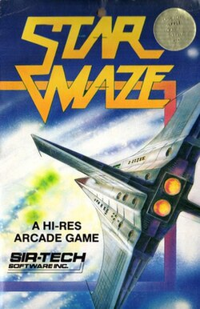

# StarMaze



A top-down arcade maze game built with Phaser 3. Navigate procedurally generated mazes, collect stars, fight enemies, and find the exit to advance through increasingly difficult levels.

## Tech Stack

- **Game Engine:** [Phaser 3](https://phaser.io/) (v3.90.0)
- **Build Tool:** [Vite](https://vitejs.dev/) (v7.3.1)
- **Language:** JavaScript (ES Modules)

All graphics are procedurally generated at runtime — no external image assets are required.

## Prerequisites

- [Node.js](https://nodejs.org/) (v18 or later recommended)
- npm (included with Node.js)

## Installation

```bash
cd starmaze
npm install
```

## Running the Game

### Development Server

```bash
npm run dev
```

This starts a local Vite dev server with hot module reloading. Open the URL printed in the terminal (typically `http://localhost:5173`) in your browser.

### Production Build

```bash
npm run build
```

Outputs optimized files to the `dist/` directory.

### Preview Production Build

```bash
npm run preview
```

Serves the `dist/` folder locally so you can test the production build before deploying.

## Project Structure

```
starmaze/
├── index.html                  # HTML entry point
├── package.json                # Dependencies and scripts
├── src/
│   ├── main.js                 # Phaser game initialization and config
│   ├── config.js               # Game constants (speeds, scores, colors, etc.)
│   ├── entities/
│   │   ├── Ship.js             # Player ship (movement, shields, lives)
│   │   ├── Enemy.js            # Enemy AI (patrol, chase, shoot)
│   │   ├── Bullet.js           # Projectile logic (player and enemy)
│   │   └── Collectible.js      # Pickups (stars, shield gems, life gems)
│   ├── scenes/
│   │   ├── BootScene.js        # Asset generation and boot
│   │   ├── GameScene.js        # Main gameplay loop
│   │   ├── HudScene.js         # Score, lives, shield, and message UI
│   │   └── GameOverScene.js    # End-of-level / game over screen
│   ├── maze/
│   │   ├── MazeGenerator.js    # Maze generation (recursive backtracker DFS)
│   │   └── MazeBuilder.js      # Converts maze data to a Phaser tilemap
│   └── utils/
│       └── TextureGenerator.js # Procedural sprite/texture creation
└── dist/                       # Production build output
```

## How It Works

### Scene Flow

1. **BootScene** — Generates all textures procedurally, then immediately launches the game.
2. **GameScene** — The main gameplay scene. Generates the maze, spawns the player, enemies, stars, gems, and the exit portal. Runs the physics and game logic each frame.
3. **HudScene** — Runs in parallel with GameScene. Renders the score, star counter, shield bar, lives display, level indicator, and temporary messages.
4. **GameOverScene** — Shown when the player completes a level or loses all lives. Displays results and waits for input to continue or restart.

### Maze Generation

Mazes are generated using a **recursive backtracker (iterative DFS)** algorithm, producing a perfect maze (exactly one path between any two cells). The maze is converted into a Phaser tilemap where each maze cell is a 7x7 tile grid (224x224 pixels). Dead-end cells are used for placing stars, gems, enemies, and the exit portal.

### Difficulty Scaling

| Aspect | Formula |
|---|---|
| Maze size | 12 + floor(level / 3) cells per dimension |
| Enemy count | 5 + level (capped by available dead-end cells) |
| Star count | 8 + (2 x level) |

## Configuration

All game constants are defined in `src/config.js`. Key values include movement speeds, fire rates, scoring, enemy AI ranges, maze dimensions, and colors. Modify this file to tweak gameplay balance.

## Development Process

StarMaze was built through an agentic pair-coding process between Jonathan and [Claude Code](https://claude.ai/claude-code), Anthropic’s AI coding assistant.

Jonathan led the creative direction of the project — defining the gameplay systems, shaping the design of the maze mechanics, and playtesting each iteration to refine the experience. Claude handled the bulk of the implementation work, generating code, structuring the project, and assisting with debugging and system design.

New features typically evolved through an iterative loop. Jonathan would propose a gameplay idea or describe a problem to solve. Claude would respond with a proposed approach and technical plan. After reviewing and refining the approach together, Claude implemented the changes. Jonathan would then playtest the result, provide feedback, and the cycle would repeat.

Many of the core gameplay systems — including fuel mechanics, shield behavior, enemy AI patterns, and procedural maze generation improvements — emerged through this collaborative process.

While the implementation was generated by Claude, every feature was guided, reviewed, and refined by Jonathan through this agentic development workflow.

The goal of this project was not only to recreate a classic maze-style arcade experience, but also to explore how modern AI coding tools can accelerate development while still benefiting from human design judgment and iterative playtesting.

## Browser Support

Runs in any modern browser that supports WebGL or Canvas 2D (Chrome, Firefox, Safari, Edge). Phaser 3 uses `Phaser.AUTO` to select the best available renderer.
